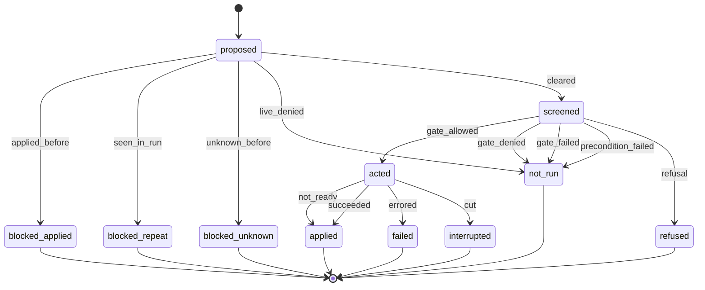

```mermaid
stateDiagram-v2
    [*] --> proposed
    acted --> applied: not_ready
    acted --> applied: succeeded
    acted --> failed: errored
    acted --> interrupted: cut
    applied --> [*]
    blocked_applied --> [*]
    blocked_repeat --> [*]
    blocked_unknown --> [*]
    failed --> [*]
    interrupted --> [*]
    not_run --> [*]
    proposed --> blocked_applied: applied_before
    proposed --> blocked_repeat: seen_in_run
    proposed --> blocked_unknown: unknown_before
    proposed --> not_run: live_denied
    proposed --> screened: cleared
    refused --> [*]
    screened --> acted: gate_allowed
    screened --> not_run: gate_denied
    screened --> not_run: gate_failed
    screened --> not_run: precondition_failed
    screened --> refused: refusal
```
