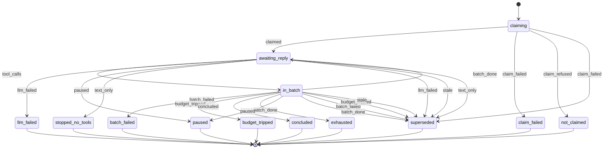

```mermaid
stateDiagram-v2
    [*] --> claiming
    awaiting_reply --> in_batch: tool_calls
    awaiting_reply --> llm_failed: llm_failed
    awaiting_reply --> paused: paused
    awaiting_reply --> stopped_no_tools: text_only
    awaiting_reply --> superseded: llm_failed
    awaiting_reply --> superseded: stale
    awaiting_reply --> superseded: text_only
    batch_failed --> [*]
    budget_tripped --> [*]
    claim_failed --> [*]
    claiming --> awaiting_reply: claimed
    claiming --> claim_failed: claim_failed
    claiming --> not_claimed: claim_refused
    claiming --> superseded: claim_failed
    concluded --> [*]
    exhausted --> [*]
    in_batch --> awaiting_reply: batch_done
    in_batch --> batch_failed: batch_failed
    in_batch --> budget_tripped: budget_tripped
    in_batch --> concluded: concluded
    in_batch --> exhausted: batch_done
    in_batch --> paused: paused
    in_batch --> superseded: batch_done
    in_batch --> superseded: batch_failed
    in_batch --> superseded: budget_tripped
    in_batch --> superseded: stale
    llm_failed --> [*]
    not_claimed --> [*]
    paused --> [*]
    stopped_no_tools --> [*]
    superseded --> [*]
```
