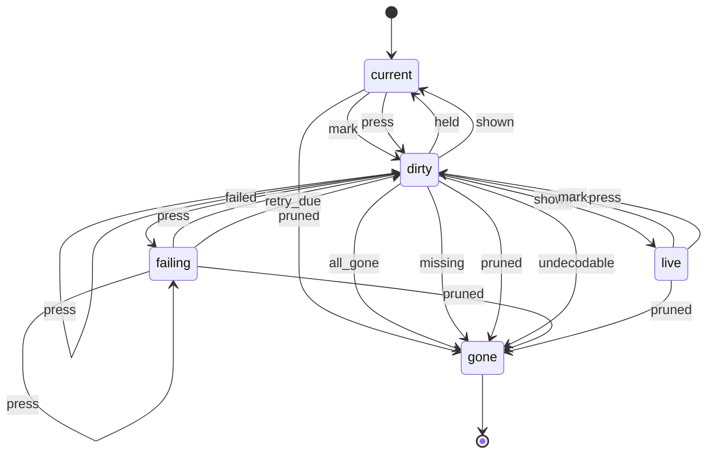

```mermaid
stateDiagram-v2
    [*] --> current
    current --> dirty: mark
    current --> dirty: press
    current --> gone: pruned
    dirty --> current: held
    dirty --> current: shown
    dirty --> dirty: mark
    dirty --> dirty: press
    dirty --> failing: failed
    dirty --> gone: all_gone
    dirty --> gone: missing
    dirty --> gone: pruned
    dirty --> gone: undecodable
    dirty --> live: shown
    failing --> dirty: press
    failing --> dirty: retry_due
    failing --> failing: mark
    failing --> failing: press
    failing --> gone: pruned
    gone --> [*]
    live --> dirty: mark
    live --> dirty: press
    live --> gone: pruned
```
