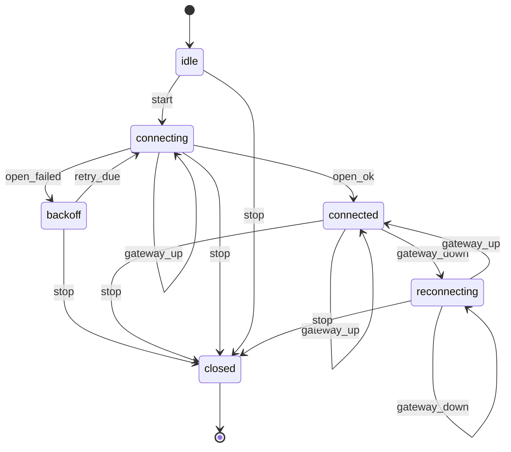

```mermaid
stateDiagram-v2
    [*] --> idle
    backoff --> closed: stop
    backoff --> connecting: retry_due
    closed --> [*]
    connected --> closed: stop
    connected --> connected: gateway_up
    connected --> reconnecting: gateway_down
    connecting --> backoff: open_failed
    connecting --> closed: stop
    connecting --> connected: open_ok
    connecting --> connecting: gateway_down
    connecting --> connecting: gateway_up
    idle --> closed: stop
    idle --> connecting: start
    reconnecting --> closed: stop
    reconnecting --> connected: gateway_up
    reconnecting --> reconnecting: gateway_down
```
