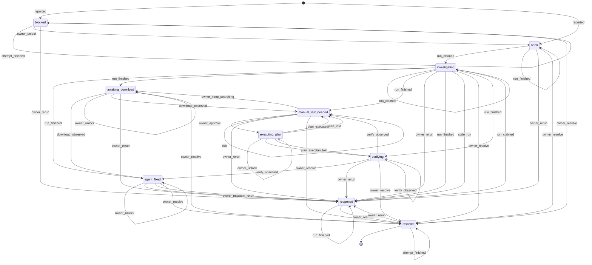

```mermaid
stateDiagram-v2
    [*] --> blocked: reported
    [*] --> open: reported
    agent_fixed --> agent_fixed: attempt_finished
    agent_fixed --> agent_fixed: owner_unlock
    agent_fixed --> reopened: owner_rerun
    agent_fixed --> reopened: system_rerun
    agent_fixed --> resolved: owner_resolve
    awaiting_download --> agent_fixed: download_observed
    awaiting_download --> awaiting_download: attempt_finished
    awaiting_download --> awaiting_download: download_observed
    awaiting_download --> awaiting_download: owner_unlock
    awaiting_download --> manual_test_needed: download_observed
    awaiting_download --> reopened: owner_rerun
    awaiting_download --> resolved: owner_resolve
    blocked --> blocked: attempt_finished
    blocked --> open: owner_unlock
    blocked --> reopened: owner_rerun
    blocked --> resolved: owner_resolve
    executing_plan --> executing_plan: attempt_finished
    executing_plan --> executing_plan: owner_unlock
    executing_plan --> manual_test_needed: plan_executed
    executing_plan --> manual_test_needed: plan_lost
    executing_plan --> verifying: plan_executed
    executing_plan --> verifying: plan_lost
    investigating --> agent_fixed: run_finished
    investigating --> awaiting_download: run_finished
    investigating --> investigating: action_attempted
    investigating --> investigating: attempt_finished
    investigating --> investigating: owner_unlock
    investigating --> investigating: run_claimed
    investigating --> manual_test_needed: run_finished
    investigating --> reopened: owner_rerun
    investigating --> reopened: run_finished
    investigating --> reopened: stale_run
    investigating --> resolved: owner_resolve
    investigating --> verifying: run_finished
    manual_test_needed --> awaiting_download: owner_keep_searching
    manual_test_needed --> executing_plan: owner_approve
    manual_test_needed --> manual_test_needed: attempt_finished
    manual_test_needed --> manual_test_needed: owner_approve
    manual_test_needed --> manual_test_needed: owner_preview
    manual_test_needed --> manual_test_needed: owner_unlock
    manual_test_needed --> manual_test_needed: tick
    manual_test_needed --> reopened: owner_rerun
    manual_test_needed --> resolved: owner_resolve
    open --> investigating: run_claimed
    open --> open: attempt_finished
    open --> open: owner_unlock
    open --> open: relaunch
    open --> open: resumed
    open --> open: run_finished
    open --> reopened: owner_rerun
    open --> resolved: owner_resolve
    reopened --> investigating: run_claimed
    reopened --> reopened: attempt_finished
    reopened --> reopened: owner_rerun
    reopened --> reopened: owner_unlock
    reopened --> reopened: relaunch
    reopened --> reopened: resumed
    reopened --> reopened: run_finished
    reopened --> resolved: owner_resolve
    resolved --> [*]
    resolved --> reopened: owner_rerun
    resolved --> resolved: attempt_finished
    verifying --> agent_fixed: verify_observed
    verifying --> manual_test_needed: verify_observed
    verifying --> reopened: owner_rerun
    verifying --> resolved: owner_resolve
    verifying --> verifying: attempt_finished
    verifying --> verifying: owner_unlock
    verifying --> verifying: verify_observed
```
