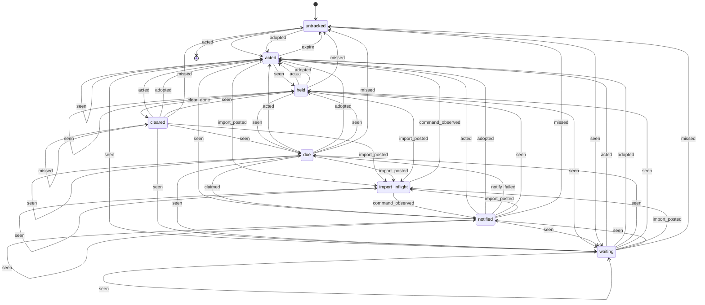

```mermaid
stateDiagram-v2
    [*] --> untracked
    acted --> acted: missed
    acted --> acted: resumed
    acted --> acted: seen
    acted --> held: seen
    acted --> import_inflight: import_posted
    acted --> notified: seen
    acted --> untracked: expire
    acted --> waiting: seen
    cleared --> acted: acted
    cleared --> acted: adopted
    cleared --> cleared: missed
    cleared --> due: seen
    cleared --> held: seen
    cleared --> import_inflight: import_posted
    cleared --> untracked: missed
    cleared --> waiting: seen
    due --> acted: acted
    due --> acted: adopted
    due --> due: missed
    due --> due: seen
    due --> held: seen
    due --> import_inflight: import_posted
    due --> notified: claimed
    due --> untracked: missed
    due --> waiting: seen
    held --> acted: acted
    held --> acted: adopted
    held --> cleared: clear_done
    held --> due: seen
    held --> held: clear_failed
    held --> held: missed
    held --> held: seen
    held --> import_inflight: import_posted
    held --> untracked: missed
    held --> waiting: seen
    import_inflight --> acted: command_observed
    import_inflight --> import_inflight: command_observed
    import_inflight --> import_inflight: missed
    import_inflight --> import_inflight: seen
    import_inflight --> notified: command_observed
    notified --> acted: acted
    notified --> acted: adopted
    notified --> due: notify_failed
    notified --> held: seen
    notified --> import_inflight: import_posted
    notified --> notified: missed
    notified --> notified: seen
    notified --> untracked: missed
    notified --> waiting: seen
    untracked --> [*]
    untracked --> acted: acted
    untracked --> acted: adopted
    untracked --> waiting: seen
    waiting --> acted: acted
    waiting --> acted: adopted
    waiting --> due: seen
    waiting --> held: seen
    waiting --> import_inflight: import_posted
    waiting --> notified: seen
    waiting --> untracked: missed
    waiting --> waiting: missed
    waiting --> waiting: seen
```
