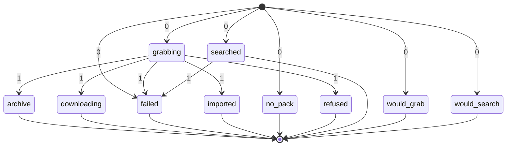

```mermaid
stateDiagram-v2
    [*] --> failed: 0
    [*] --> grabbing: 0
    [*] --> no_pack: 0
    [*] --> searched: 0
    [*] --> would_grab: 0
    [*] --> would_search: 0
    archive --> [*]
    downloading --> [*]
    failed --> [*]
    grabbing --> archive: 1
    grabbing --> downloading: 1
    grabbing --> failed: 1
    grabbing --> imported: 1
    grabbing --> refused: 1
    imported --> [*]
    no_pack --> [*]
    refused --> [*]
    searched --> [*]
    searched --> failed: 1
    would_grab --> [*]
    would_search --> [*]
```
