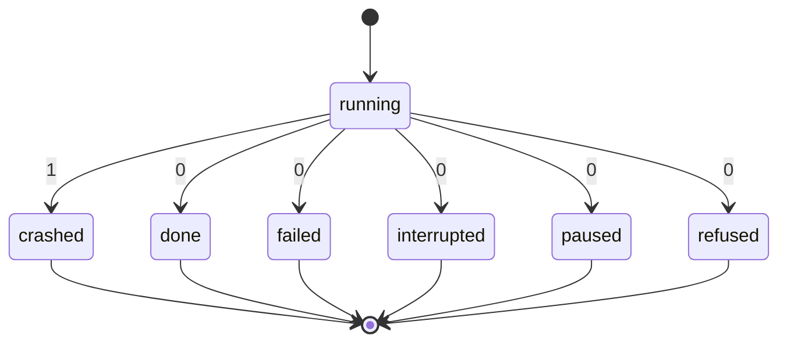

```mermaid
stateDiagram-v2
    [*] --> running
    crashed --> [*]
    done --> [*]
    failed --> [*]
    interrupted --> [*]
    paused --> [*]
    refused --> [*]
    running --> crashed: 1
    running --> done: 0
    running --> failed: 0
    running --> interrupted: 0
    running --> paused: 0
    running --> refused: 0
```
